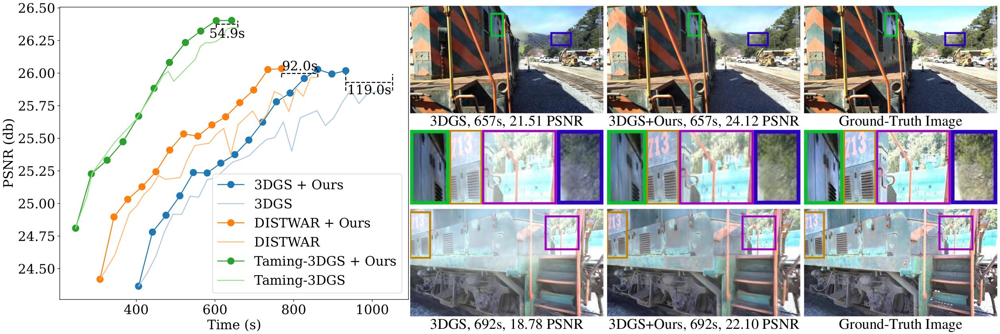

# 3DGS-LM
3DGS-LM accelerates Gaussian-Splatting optimization by replacing the ADAM optimizer with Levenberg-Marquardt.

This is the official repository that contains source code for the arXiV 2024 paper [3DGS-LM](https://lukashoel.github.io/3DGS-LM).

[[arXiv](https://arxiv.org/abs/2409.12892)] [[Project Page](https://lukashoel.github.io/3DGS-LM/)] [[Video](https://youtu.be/tDiGuGMssg8)]



If you find 3DGS-LM useful for your work please cite:
```
@preprint{hoellein_2024_3dgslm,
    title={3DGS-LM: Faster Gaussian-Splatting Optimization with Levenberg-Marquardt},
    author={H{\"o}llein, Lukas and Bo\v{z}i\v{c}, Alja\v{z} and Zollh{\"o}fer, Michael and Nie{\ss}ner, Matthias},
    booktitle={arXiV:2409.12892},
    year={2024}
}
```

## Code Coming Soon...
